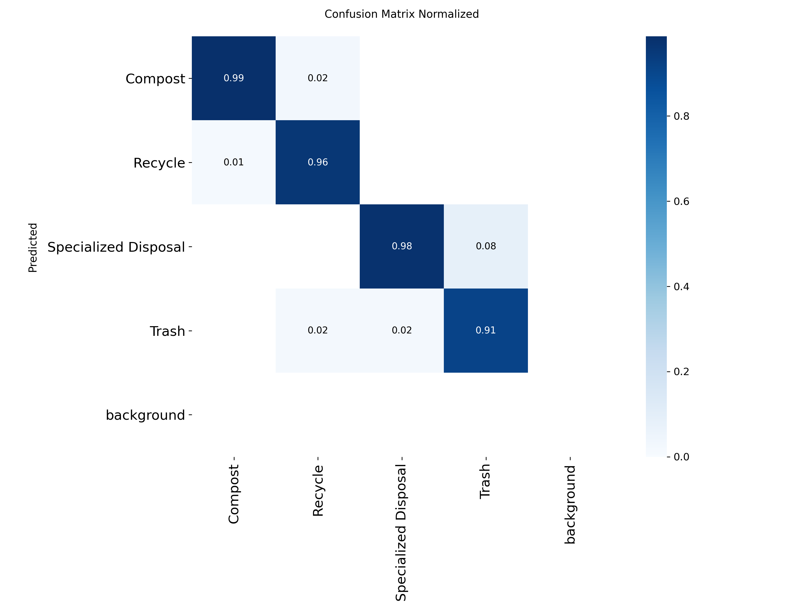
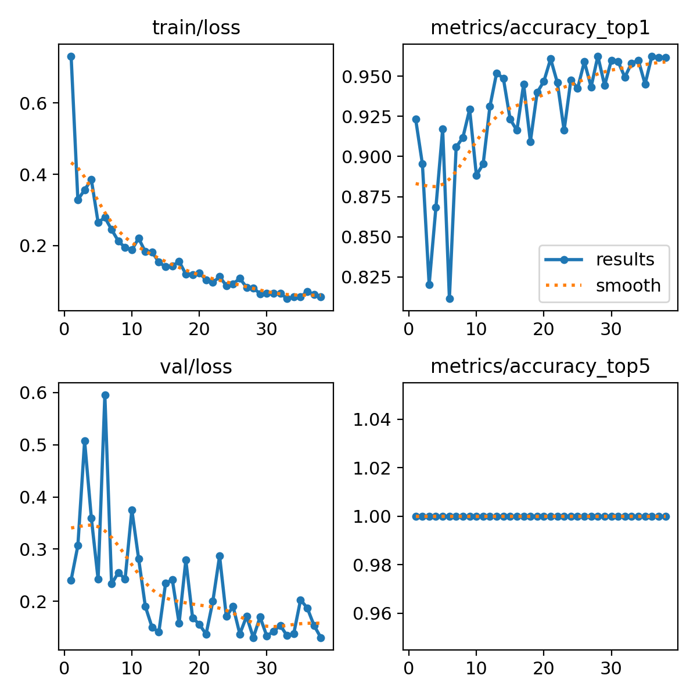

# Waste Identifer Classifcation Model 
**By Amanda Sim**

# Context 
This classification model aims to identify items and categorize them based on how they should be disposed of. Using YOLOv11, 
this model fine-tunes previously trained datasets from Roboflow to fit new classes: recycle, trash, compost, and specialized disposal. 
This model is intented to be used to help people correctly dispose of their items and can be used for smart bins, which detected the item a 
person is holding and opens to the appropriate bin or for apps where the user can take a photo of the item and identify where it goes and how
to dispose of it. 

---

# Training Data 
#### Datasets
1. [Classifcation waste Computer Vision Model](https://universe.roboflow.com/gkhang/classification-waste) by GKHANG

     **Classes**: 10

     **Images**: 10,289

2. [Trash Computer Vision Dataset](https://universe.roboflow.com/baile/trash-izcuy) by BAILE

   **Classes**: 48

   **Images**: 101

#### Class Distribution
After merging the two datasets, I reorganized the classes into their new perspective classes seen in the table below.
| Recycle - 6,640 - 5,033 = 1,607 | Trash - 1,023 | Compost - 1,814 | Specialized Disposal - 1,026 | Deleted - 27 |
|---|---|---|---|---|
| Glass   Paper   Cardboard   Metal   Plastic   Glass   Drink can   Pop tab   Clear plastic bottle  Food can   Glass bottle   Glass jar   Other plastic bottle   Normal paper   Other carton   Other plastic wrapper   Aerosol   Aluminium foil   Drink carton   Paper bag   Toilet tube   Corrugated carton   Metal lid   Spread tub   Meal carton | Broken glass   Gloves   Masks   Cigarette   Plastic film   Foam cup   Disposable food container   Crisp packet   Metal bottle cap   Plastic lid   Plastic straws   Plastic utensils   Paper cup   Aluminium blister pack   Garbage bag   Tissues   Styrofoam piece   Paper straw   Single use carrier bag   Squeezable tube   Rope & string   Shoe   6 pack rings   Disposable plastic cup | Biodegradable   Food waste   Egg carton | Syringe   Medicines   Metal bottle cap   Battery | Plastic bottle caps   Glass cup   Unlabeled litter   Other plastic |

This is the final class distributions
|Class                  | Train | Valid |  Test | Total |
|-----------------------|------:|------:|------:|------:|
|Recycle                |  992  |  324  |  234  | 1,607 |
|Trash                  |  626  |  223  |  151  | 1,023 |
|Compost                | 1,151 |  389  |  269  | 1,814 |
|Specialized Disposal   |  667  |  219  |  140  | 1,026 |

#### Annotation Process
For the compost class, some images included items that could not be composted (ex, red meat). I reviewed all the images and 
moved non-compostable food waste to the trash category.  

For the classes I chose to delete, the first one being plastic bottle caps, from Google searches, it is generally 
recommended to keep your bottle caps on your bottles when recycling, but for recycling plastic bottle caps, there were
specific requirements on what size can and cannot be recycled. For example, according to the Seattle Public Utilities, 
loose bottle caps less than 3 inches in diameter go into the trash 
([Seattle Public Utilities](https://www.seattle.gov/utilities/your-services/collection-and-disposal/where-does-it-go#/a-z )). 
However, from the images alone, it’s difficult to interpret the size of the caps, so for less confusion in training, 
I choose to opt out of including them. For glass cups, they cannot be recycled and generally recommended to donate them; 
however, since there are only 3 images in this class, rather than adding a new “donate” class and risk significant class imbalance,
I choose to delete them. Lastly, for both unlabelled litter and other plastic, it was difficult to identify these items, so I chose
to delete them to minimize confusion.  

For the recycle class, it came up to a total of 6,640 images, but because the rest of the classes were within the 1,000 range, 
and I wanted to try to prevent any false negatives and accuracy issues from imbalanced classes, I chose to delete 5,033 images
from the class and ended up with 1,607.  

#### Train/Valid/Test Split 
- **Train**: 3,421 images (64%)
- **Valid**: 1,145 images (21%)
- **Test**: 791 images (15%)

#### Augmentations 
- None

---

# Training Procedure 
- **Framework**: Ultralytics
- **Hardware**: NVIDIA A100-SXM4-80GB
- **Batch Size**: 64
- **Epochs**: 50
- **Image Size**: 640
- **Patience**: 10
- **Preprocessing**: None 

- _Early Stopping_: 38 epochs

---

# Evaluation Results 
**Overall Breakdown**
| Top 1 Accuracy        | F1-Score | Precision | Recall |
|-----------------------|---------:|----------:|-------:|
|       0.962           |    0.96  |    0.96   |  0.96  |

**Per-Class Breakdown**
| Class                 | Precision | Recall | F1-Score |
|-----------------------|----------:|-------:|---------:|
| Recycle               |   0.98    |  0.96  |   0.97   |
| Trash                 |   0.95    |  0.91  |   0.93   |
| Compost               |   0.98    |  0.99  |   0.98   |
| Specialized Disposal  |   0.98    |  0.99  |   0.98   |

**Class Examples**
- Recycle

- Trash

- Compost

- Specialized Disposal

**Confusion Matrix**

**Train/Loss and Val/Loss Curves**

**Peformance Analysis**

From this model, the overall performance indicate high accuracy, with the top 1 accuracy being 0.962 and each class having a F1-score
in the 0.9 range. From the confusion matrix, we can see a perfect diagonal, which indicates the model was able to accurately predict
the items correctly. However we do see a few false negatives and positives, specifically where the model mixed up trash and specalized disposal is the highest, but this is very minor.
Looking at the train/loss curve shows that the model is learning effectively, with the downward shape curve and decreasing spikes as the 
longer the model trains. From the metrics/accuracy_top1 curve we see large spikes towards the beginning of the training process but the 
spikes slowly decreases as it trains longer, which indicates the model is improving it’s accuracy and showing stable performance. 
For the validation loss curve, we see extremely high spikes towards the beginning, but the spikes slowly decreases as more training time
is applied. Lastly, for the metrics/accuracy_top5, this shows up as a horizontal line at 1 due to the fact that I only have 4 classes. 
Overall, my model indicates high accuracy and no cases of overfitting, however, the model could benefit from longer training time to
allow the curves to smoothen out further and reach an eventual straight horizontal line. 

--- 

# Limitations and Biases

**Failure Cases**
- Struggled at identifying compost majority of the time
  - ex: misidentifed bananas as recycle 
- Confused specialized disposal for trash
  - ex: items belonging in the trash class featured in images identified as specialized disposal
    - someone wearing gloves while holding a syringe 

**Limitation**
- Decisions on which classes belong in which were made based on Seattle's disposal guidelines, which can’t be used worldwide or statewide due to different disposal requirements and regulations.
- Model lacks representation and diversity in types of items in each class

**Poor Performing Class: Compost**
- Majority of images in the compost class feature pixelated or low-quality images, making it difficult for the model to identify items in this class correctly.
